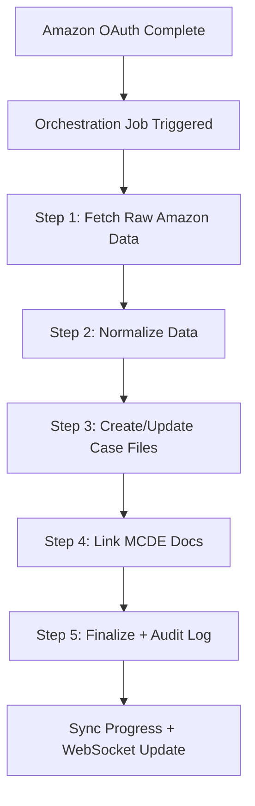

# Opside Integrations Hub Backend

A production-grade backend for Opside's Integrations Hub that securely connects to Amazon SP-API, Gmail, and Stripe with OAuth 2.0 token management and real-time data synchronization.

## 🚀 Features

- **Secure OAuth 2.0 Integration**: Connect to Amazon SP-API, Gmail, and Stripe
- **Token Management**: Encrypted token storage with automatic refresh
- **Real-time Data Sync**: Background jobs for claims, reimbursements, and fees
- **Data Orchestration Layer**: Maps raw Amazon data to Refund Engine schema
- **MCDE Document Linking**: Automatically links Manufacturing Cost Document Engine docs with claims
- **Case File Ledger**: Unified audit tracking system with comprehensive ledger entries
- **Silent Stripe Connect**: Automatic Stripe account creation after Amazon OAuth
- **Sync Progress Dashboard**: Real-time progress tracking with WebSocket updates
- **Enhanced Job Orchestration**: BullMQ-powered 5-step ingestion process
- **Enterprise Security**: Encryption, rate limiting, and comprehensive logging
- **Modular Architecture**: Clean service layer structure with stub functions
- **TypeScript**: Full type safety and modern development experience

## 📋 Requirements

- Node.js 18+ 
- TypeScript 5.3+
- Supabase account for token storage
- Redis server for job queues
- API credentials for Amazon SP-API, Gmail, and Stripe

## 🛠️ Installation

1. **Clone the repository**
   ```bash
   git clone <repository-url>
   cd integrations-backend
   ```

2. **Install dependencies**
   ```bash
   npm install
   ```

3. **Set up environment variables**
   ```bash
   cp env.example .env
   ```
   
   Edit `.env` with your configuration:
   ```env
   # Server Configuration
   PORT=3000
   NODE_ENV=development
   
   # Supabase Configuration
   SUPABASE_URL=your_supabase_url
   SUPABASE_ANON_KEY=your_supabase_anon_key
   SUPABASE_SERVICE_ROLE_KEY=your_supabase_service_role_key
   
   # JWT Configuration
   JWT_SECRET=your_jwt_secret_key_here
   JWT_EXPIRES_IN=24h
   
   # Amazon SP-API Configuration
   AMAZON_CLIENT_ID=your_amazon_client_id
   AMAZON_CLIENT_SECRET=your_amazon_client_secret
   AMAZON_REDIRECT_URI=http://localhost:3000/api/amazon/callback
   
   # Gmail API Configuration
   GMAIL_CLIENT_ID=your_gmail_client_id
   GMAIL_CLIENT_SECRET=your_gmail_client_secret
   GMAIL_REDIRECT_URI=http://localhost:3000/api/gmail/callback
   
   # Stripe Configuration
   STRIPE_CLIENT_ID=your_stripe_client_id
   STRIPE_CLIENT_SECRET=your_stripe_client_secret
   STRIPE_REDIRECT_URI=http://localhost:3000/api/stripe/callback
   
   # Encryption
   ENCRYPTION_KEY=your_32_character_encryption_key_here
   
   # Redis (for job queues)
   REDIS_URL=redis://localhost:6379
   ```

4. **Set up Supabase database**
   
   Create the following table in your Supabase database:
   ```sql
   CREATE TABLE tokens (
     id UUID DEFAULT gen_random_uuid() PRIMARY KEY,
     user_id TEXT NOT NULL,
     provider TEXT NOT NULL CHECK (provider IN ('amazon', 'gmail', 'stripe')),
     access_token TEXT NOT NULL,
     refresh_token TEXT NOT NULL,
     expires_at TIMESTAMP WITH TIME ZONE NOT NULL,
     created_at TIMESTAMP WITH TIME ZONE DEFAULT NOW(),
     updated_at TIMESTAMP WITH TIME ZONE DEFAULT NOW(),
     UNIQUE(user_id, provider)
   );
   
   CREATE INDEX idx_tokens_user_provider ON tokens(user_id, provider);
   ```
   
   Run the additional migration for enhanced features:
   ```sql
   -- Run the migration file: migrations/002_add_case_file_ledger.sql
   ```

## 🚀 Usage

### Development
```bash
npm run dev
```

### Production
```bash
npm run build
npm start
```

### Testing
```bash
npm test
npm run test:watch
```

## 📁 Project Structure

```
integrations-backend/
│── src/
│   ├── index.ts                   # Express app entry point
│   ├── config/
│   │   └── env.ts                 # Environment configuration
│   ├── routes/
│   │   ├── amazonRoutes.ts        # Amazon OAuth routes
│   │   ├── gmailRoutes.ts         # Gmail OAuth routes
│   │   └── stripeRoutes.ts        # Stripe OAuth routes
│   ├── controllers/
│   │   ├── amazonController.ts    # Amazon API handlers
│   │   ├── gmailController.ts     # Gmail API handlers
│   │   └── stripeController.ts    # Stripe API handlers
│   ├── services/
│   │   ├── amazonService.ts       # Amazon SP-API integration
│   │   ├── gmailService.ts        # Gmail API integration
│   │   └── stripeService.ts       # Stripe API integration
│   ├── utils/
│   │   ├── tokenManager.ts        # Encrypted token management
│   │   ├── logger.ts              # Winston logging
│   │   └── errorHandler.ts        # Error handling middleware
│   ├── jobs/
│   │   ├── amazonSyncJob.ts       # Amazon data sync background job
│   │   └── stripeSyncJob.ts       # Stripe data sync background job
│   ├── database/
│   │   └── supabaseClient.ts      # Supabase connection
│   └── middleware/
│       └── authMiddleware.ts      # JWT authentication
│
├── tests/
│   ├── amazonService.test.ts
│   ├── gmailService.test.ts
│   └── stripeService.test.ts
│
├── package.json
├── tsconfig.json
├── jest.config.js
├── env.example
└── README.md
```

## 🔌 API Endpoints

### Health Check
- `GET /health` - Server health status

### Amazon SP-API
- `GET /api/amazon/auth` - Initiate OAuth
- `GET /api/amazon/callback` - OAuth callback
- `GET /api/amazon/claims` - Fetch claims
- `GET /api/amazon/inventory` - Fetch inventory
- `GET /api/amazon/fees` - Fetch fees
- `DELETE /api/amazon/disconnect` - Disconnect integration

### Gmail
- `GET /api/gmail/auth` - Initiate OAuth
- `GET /api/gmail/callback` - OAuth callback
- `POST /api/gmail/connect` - Connect Gmail
- `GET /api/gmail/emails` - Fetch emails
- `GET /api/gmail/search` - Search emails
- `DELETE /api/gmail/disconnect` - Disconnect integration

### Stripe
- `GET /api/stripe/auth` - Initiate OAuth
- `GET /api/stripe/callback` - OAuth callback
- `POST /api/stripe/connect` - Connect Stripe
- `GET /api/stripe/transactions` - Fetch transactions
- `GET /api/stripe/account` - Get account info
- `GET /api/stripe/transactions/:id` - Get specific transaction
- `DELETE /api/stripe/disconnect` - Disconnect integration

### Sync Progress Dashboard
- `GET /api/sync/status/:syncId` - Get current sync status
- `GET /api/sync/history` - Get sync history for user
- `POST /api/sync/start` - Start a new sync operation
- `DELETE /api/sync/cancel/:syncId` - Cancel ongoing sync
- `GET /api/sync/statistics` - Get sync statistics for dashboard

## 🔐 Security Features

- **Token Encryption**: All OAuth tokens are encrypted using AES-256-CBC
- **Rate Limiting**: Configurable rate limiting per IP
- **CORS Protection**: Secure cross-origin resource sharing
- **Helmet Security**: HTTP security headers
- **JWT Authentication**: Secure route protection
- **Input Validation**: Request parameter validation
- **Comprehensive Logging**: Winston logging with structured data

## 🔄 Background Jobs

### Amazon Sync Job
- **Schedule**: Every hour
- **Data**: Claims, inventory, and fees
- **Features**: Automatic token refresh, error handling

### Stripe Sync Job
- **Schedule**: Every 30 minutes
- **Data**: Transactions and account information
- **Features**: Rate limiting, incremental sync

### Enhanced Job Orchestration
- **Engine**: BullMQ with Redis
- **Process**: 5-step data ingestion pipeline
- **Features**: Real-time progress tracking, WebSocket updates, automatic retries
- **Steps**:
  1. Fetch Amazon Claims
  2. Link MCDE Documents
  3. Create Ledger Entries
  4. Process Stripe Transactions
  5. Finalize Cases

## 🧪 Testing

The project includes comprehensive test coverage:

```bash
# Run all tests
npm test

# Run tests in watch mode
npm run test:watch

# Run tests with coverage
npm run test -- --coverage
```

## 🔧 Configuration

### Environment Variables

| Variable | Description | Required |
|----------|-------------|----------|
| `PORT` | Server port | No (default: 3000) |
| `NODE_ENV` | Environment | No (default: development) |
| `SUPABASE_URL` | Supabase URL | Yes |
| `SUPABASE_ANON_KEY` | Supabase anonymous key | Yes |
| `JWT_SECRET` | JWT signing secret | Yes |
| `ENCRYPTION_KEY` | 32-character encryption key | Yes |
| `AMAZON_CLIENT_ID` | Amazon SP-API client ID | Yes |
| `AMAZON_CLIENT_SECRET` | Amazon SP-API client secret | Yes |
| `GMAIL_CLIENT_ID` | Gmail API client ID | Yes |
| `GMAIL_CLIENT_SECRET` | Gmail API client secret | Yes |
| `STRIPE_CLIENT_ID` | Stripe client ID | Yes |
| `STRIPE_CLIENT_SECRET` | Stripe client secret | Yes |
| `REDIS_URL` | Redis connection URL | No (default: redis://localhost:6379) |

## 🚀 Deployment

### Docker (Recommended)

```dockerfile
FROM node:18-alpine

WORKDIR /app

COPY package*.json ./
RUN npm ci --only=production

COPY dist ./dist

EXPOSE 3000

CMD ["node", "dist/index.js"]
```

### Environment Setup

1. Set up your production environment variables
2. Configure your database connections
3. Set up SSL certificates
4. Configure reverse proxy (nginx recommended)
5. Set up monitoring and logging

## 🤝 Contributing

1. Fork the repository
2. Create a feature branch
3. Make your changes
4. Add tests for new functionality
5. Ensure all tests pass
6. Submit a pull request

## 📄 License

This project is licensed under the MIT License.

## 🆘 Support

For support and questions:
- Create an issue in the repository
- Contact the development team
- Check the documentation

## 🔄 Updates

### Version 1.0.0
- Initial release with Amazon SP-API, Gmail, and Stripe integrations
- OAuth 2.0 token management
- Background job synchronization
- Comprehensive security features
- Full TypeScript implementation 

## 🕶️ Silent Stripe Onboarding

When a user completes Amazon OAuth, the backend automatically creates a Stripe Connect Express account in the background (no user action required). This is handled by a BullMQ job that retries up to 3 times with exponential backoff. The resulting stripe_account_id is stored in the new `stripe_accounts` table and linked to the user.

- **Flow:**
  1. User completes Amazon OAuth
  2. Backend enqueues a silent onboarding job
  3. Job creates Stripe account via Stripe Node SDK
  4. Account ID is stored in `stripe_accounts` (linked to user)
  5. No user interaction or delay in OAuth response
  6. Errors are retried and logged (never logs secrets)

- **Database Schema:**
  ```sql
  CREATE TABLE stripe_accounts (
    id UUID PRIMARY KEY DEFAULT gen_random_uuid(),
    user_id UUID REFERENCES users(id) ON DELETE CASCADE,
    stripe_account_id TEXT NOT NULL,
    created_at TIMESTAMP DEFAULT NOW()
  );
  CREATE UNIQUE INDEX idx_stripe_accounts_user_id ON stripe_accounts(user_id);
  CREATE INDEX idx_stripe_accounts_stripe_account_id ON stripe_accounts(stripe_account_id);
  -- RLS policies ensure users can only access their own account
  ```

- **API Endpoint:**
  - `GET /api/v1/stripe/status` — Returns `{ success: true, status: 'created' | 'not_found' }` for the current user.

- **Testing:**
  - Unit tests in `tests/stripeOnboarding.test.ts` cover:
    - Successful onboarding
    - Retry logic
    - Error handling
    - Status endpoint
  - Run with `npm test` or `npm run test:watch` 

## 🧩 Refund Engine Case Ledger (refund_engine_cases)

| Column         | Type    | Description                                 |
| -------------- | ------- | ------------------------------------------- |
| id             | UUID    | Primary key                                |
| user_id        | UUID    | User who owns the case                      |
| claim_id       | TEXT    | Amazon claim ID                             |
| mcde_doc_id    | TEXT    | Linked MCDE cost doc ID (nullable)          |
| case_status    | TEXT    | Status (e.g., synced, processed, etc.)      |
| synced_at      | TIMESTAMP | When the case was last synced             |
| raw_data       | JSONB   | Raw Amazon report data                      |
| normalized_data| JSONB   | Normalized ledger entries                   |
| audit_log      | JSONB   | Audit trail of orchestration steps          |
| created_at     | TIMESTAMP | Row creation timestamp                    |

- **Index:** (user_id, claim_id)
- **RLS:** Only the owning user can access their cases.

## 🔄 Orchestration Flow Diagram



## 📡 /sync-status API

- **Endpoint:** `GET /api/v1/sync/status/:syncId`
- **Response:**
  ```json
  {
    "success": true,
    "data": {
      "syncId": "sync-123",
      "stage": "Normalizing Amazon data",
      "percent": 40,
      "totalCases": 10,
      "processedCases": 8,
      "audit": [ ... ],
      "updatedAt": "2024-06-01T12:00:00Z"
    }
  }
  ```

## 🔔 WebSocket Event: sync_progress_update

- **Payload:**
  ```json
  {
    "syncId": "sync-123",
    "stage": "Normalizing Amazon data",
    "percent": 40,
    "totalCases": 10,
    "processedCases": 8,
    "audit": [ ... ],
    "updatedAt": "2024-06-01T12:00:00Z"
  }
  ```

## 🛠️ Developer Guide: Running Orchestration Locally

1. **Start Redis and Postgres**
2. **Run migrations:**
   ```bash
   npm run migrate
   ```
3. **Start backend:**
   ```bash
   npm run dev
   ```
4. **Trigger orchestration:**
   - Complete Amazon OAuth in the UI, or
   - Call the sync start API:
     ```bash
     curl -X POST http://localhost:3000/api/v1/sync/start -H "Authorization: Bearer <token>"
     ```
5. **Monitor progress:**
   - Use `/api/v1/sync/status/:syncId` for polling
   - Or connect to WebSocket for real-time updates

**Expected output:**
- Ledger entries in `refund_engine_cases`
- Linked MCDE docs
- Real-time progress in API/WebSocket
- No duplicate cases on repeated runs 